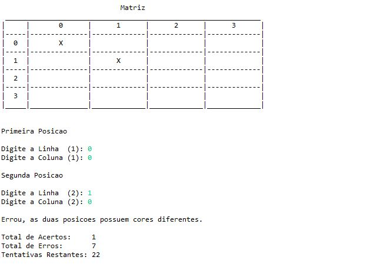
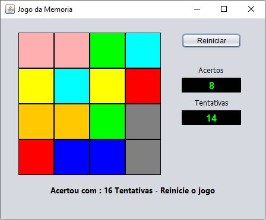

# Momory Game

Esse projeto consiste em dois jogos de Memória onde um faz o uso do java swing para ser jogado e outro
faz o uso do console, ambos compartilham a classe MemoryGame para executar o jogo internamente.

## Classe MemoryGame
* __Variáveis de controle__ - as variáveis de controle criada são usadas para definir quantas jogadas o
jogador possúi e quantas vezes a função adivinhar retornou true

* __Matrizes__ - A Classe MemoryGame cria uma matriz 4x4 tipo color nele cada cor é alocada duas vezes
para se ter um controle do alocamento das cores é utilizado um hasmap com o código rgb da cor sendo
a chave e o número de vezes que cada cor foi usada iniciado com 0 e tendo como máximo 2 cada 
cor é alocada posição aleatoria duas vezes formando assim um par de cores iguais em locais diferentes
até que a primeira matriz seja totalmente povoada pelas cores, após isso uma segunda matriz é povoada
por strings em branco.

* __Função adivinhar__ - para invocar a função adivinhar de um objeto MemoryGame é necessário fornecer
linha e coluna de duas posições diferentes se as posições indicadas estiverem dentro dos limites do jogo
as duas posições são comparadas e o número de tentativas é reduzido em um, se a mesma cor das duas posições
for igual o é incrementado um ao número de acertos e retorna true, caso sejam diferentes retorna false, e:

  * No jogo em console a matriz populada por strings em branco tem seu conteúdo das duas posições indicadas
  trocados por "  X  " para sinalizar que foi encontrado um par nas duas posições
  
  * No jogo em Swing o retorno true ou false permitirá a o swing alterar visualmente a exibição das labels
  trocando o fundo em branco da label pelas cores selecinadas, se as cores forem iguais o jogo as mantem,
  se forem diferentes o jogo requere do usuário um duplo clique para retornar o fundo para a cor branca para
  que o mesmo continue o jogo.
  
* __Função getCor__ retorna o objeto .Color contido em determinada posição da matriz de cores desde que a 
posição informada esteja dentro dos limites da matriz

## ConsoleGame

## SwingGame

_Fiz esse projeto com o objetivo de aprimorar minhas havilidades no uso de classes e objetos na linguagem 
java e dominar a API para interfaces gráficas Swing._
